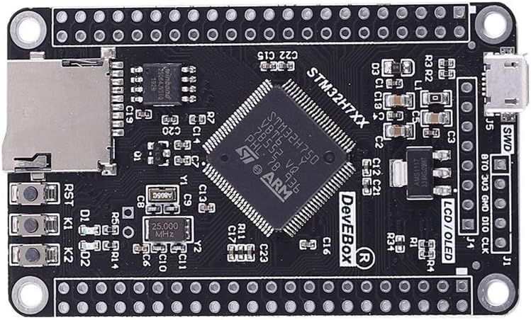

# About

W25Q64 QSPI FLASH memory STM32H750VB-DevEBox External Loader for STM32CubeProgrammer.

Huge thanks to [@manoloaterol](https://github.com/manoloaterol) and 
[@osos11-Git for](https://github.com/osos11-Git) their open-source projects.
They made it much easier to create a loader for STM32H750VB DevEBox board variant.

# Building

> Prebuilt loader is available in the `build` folder.

```bash
make VARIANT=ext_loader
mv build/ext_loader.elf build/W25Q64_STM32H750VB-DevEBox.stldr
```

## Variants

There are three build variants available:

- `ext_loader` - external loader firmware for use with STM32CubeProgrammer. **This is the default variant.**

- `int_ram` - Load an image from the QSPI flash to the internal RAM and jump execution to it.

- `ext_flash_xip` - Execute In Place (XIP) the QSPI flash memory. This variant sets up the QSPI flash memory and jumps to the application base address in the QSPI flash memory.

## ``ext_loader``

### Installation

1. Copy the `.stldr` file to the `ExternalLoader` folder of the STM32CubeProgrammer installation directory.

    ```
    cp build\W25Q64_STM32H750VB-DevEBox.stldr C:\Program Files\STMicroelectronics\STM32Cube\STM32CubeProgrammer\bin\ExternalLoader\
    ```

2. Reopen STM32CubeProgrammer and you should see the loader in the list.

## ``int_ram``

### Building
    
    ```bash
    make VARIANT=int_ram
    ```

> Image may be flashed with `st-flash --format ihex --reset write build/bootloader_int_ram.hex` and debugged with `F5` in VSCode.

## ``ext_flash_xip``

TODO

## References

- Project based on: <https://github.com/manoloaterol/MCUDEV_DevEBox_H743-W25Q64-EL>
- Knowledge source: <https://github.com/osos11-Git/STM32H743VIT6_Boring_TECH_QSPI>
