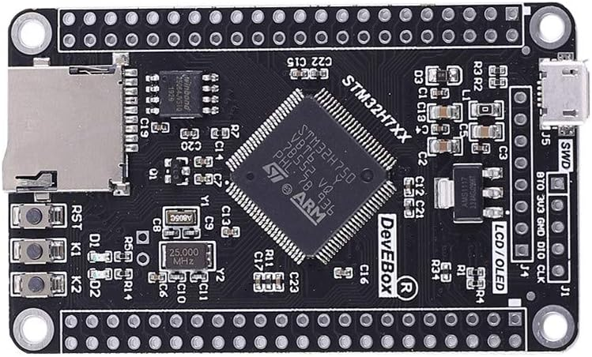

# STM32H7-DevEBox

---

This project implements multiple different mode bootloaders for the STM32H750VB
DevEBox development board with W25Q64 (64 Mbit) QSPI FLASH and integrates
various middleware to unleash the potential of the board.

> Project is developed on WSL Ubuntu.

## Bootloaders

- [`bl_iram`](docs/bl_iram.md): Bootloader that loads an application firmware
  from a file system that is mounted on the QSPI flash to the internal D1 domain
  512 KiB AXI-SRAM and executes it. On startup, bootloader runs the
  [`comm`](#comm) service for uploading new firmware over UART.
- [`bl_qspiflash`](docs/bl_qspiflash.md): Bootloader that Executes In Place
  (XIP) program stored on QSPI flash memory. On startup, bootloader runs the
  [`comm`](#comm) service for uploading new firmware over UART.
- [`ext_loader`](docs/ext_loader.md): Special [STM32 External
  Loader](https://github.com/STMicroelectronics/stm32-external-loader) firmware
  for this board for accessing the on-board W25Q64 QSPI FLASH memory in
  [STM32CubeProgrammer](https://www.st.com/en/development-tools/stm32cubeprog.html).

## Special Features

### `comm`

`comm` is a complete Point-to-Point request-response communication system for
accessing QSPI FLASH memory on the target from a host computer over serial UART.
`comm` defines request-response messages both for raw memory and file system
access ([`littlefs`](https://github.com/littlefs-project/littlefs)). `comm`
 implements both a service for baremetal MCU target in C/C++ and a client
library in Python for the host computer that together enable communication over
serial UART. `comm` is based on [`nanopb`](https://github.com/nanopb/nanopb)
data serialization library (Protocol Buffers) and
[`min`](https://github.com/min-protocol/min) Point-to-Point communication
protocol.

## TODO List

- Use [`stm32-base`](https://github.com/ObKo/stm32-cmake).
- Generalize and extract the `comm` service to a separate library.
- Use CMake for building the project rather than Makefile.
- `bl_iram` and `bl_qspiflash` tests with simple demo application binaries.
- Add copies of datasheet PDFs of MCU and QSPI FLASH to the `docs` folder.
- Pick a better name for the project.

## References

- [stm32-base STM32H750VB-DevEBox](https://stm32-base.org/boards/STM32H750VBT6-STM32H7XX-M.html#W25Q64JV)
